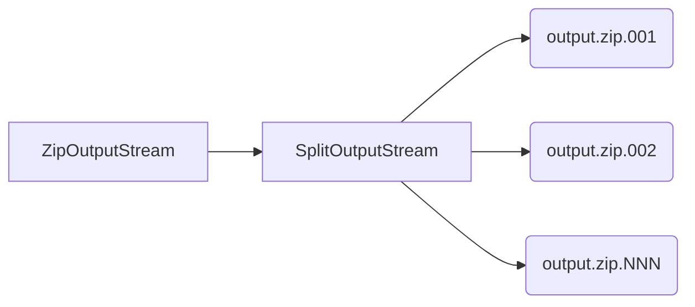

# split-zip-stream

Code sample which shows generation of multi-volume ZIP archive using standard JDK only.

## Prerequisites

* [OpenJDK 21](https://adoptium.net/temurin/archive/?version=21)
* [Apache Maven](https://maven.apache.org/download.cgi)

## Data flow

## Points to note

* Entry data are read from `InputStream`, and volume data are written to `OutputStream`. Both types of streams are not limited to files in your local filesystem, and can be implemented by various kinds of network-connected storage, including those provided by cloud vendors.

* `SplitOutputStream` is a specially crafted `OutputStream`, which will split outbound bytes to multiple volumes of fixed size, instead of writing to a single file.

* `ZipOutputStream` included in standard JDK is compatible with ZIP64 specification.
