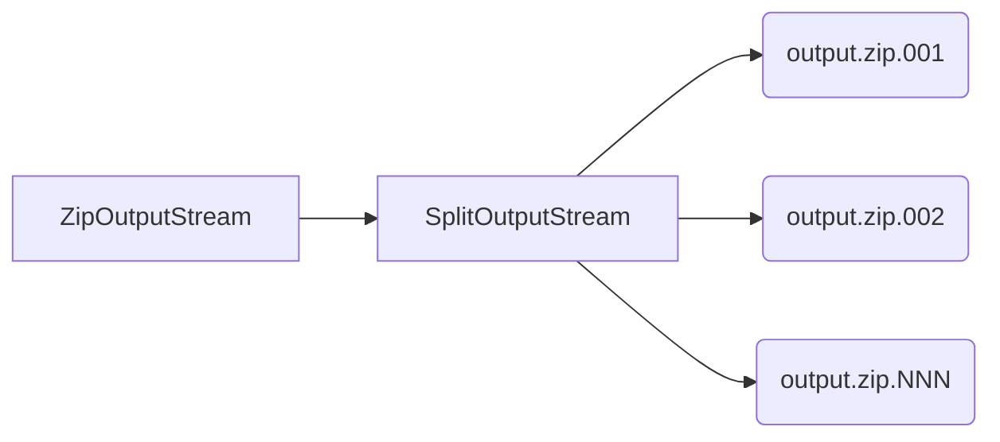

# split-zip-stream

Code sample which shows generation of multi-volume ZIP archive using standard JDK only.

## Prerequisites

* [OpenJDK 21](https://adoptium.net/temurin/archive/?version=21)
* [Apache Maven](https://maven.apache.org/download.cgi)

## Data flow

